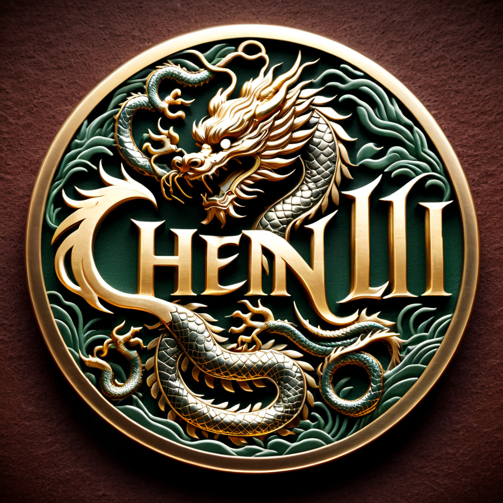
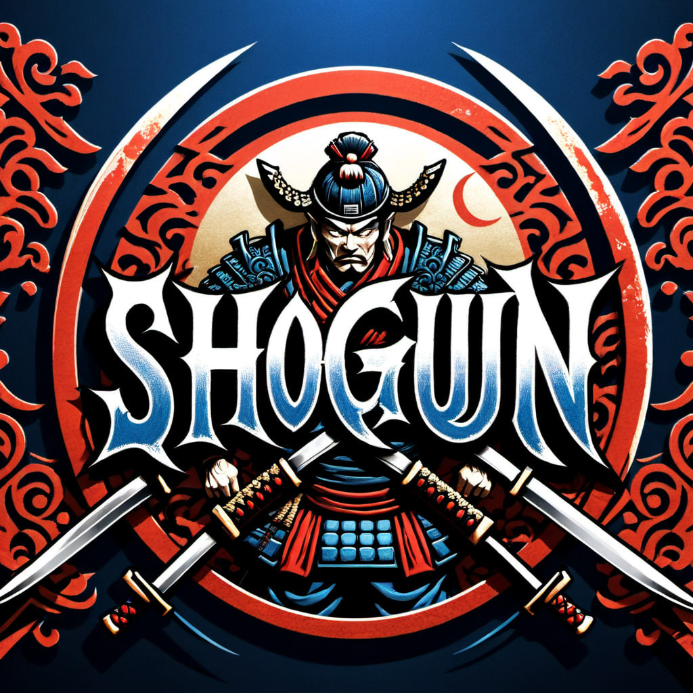
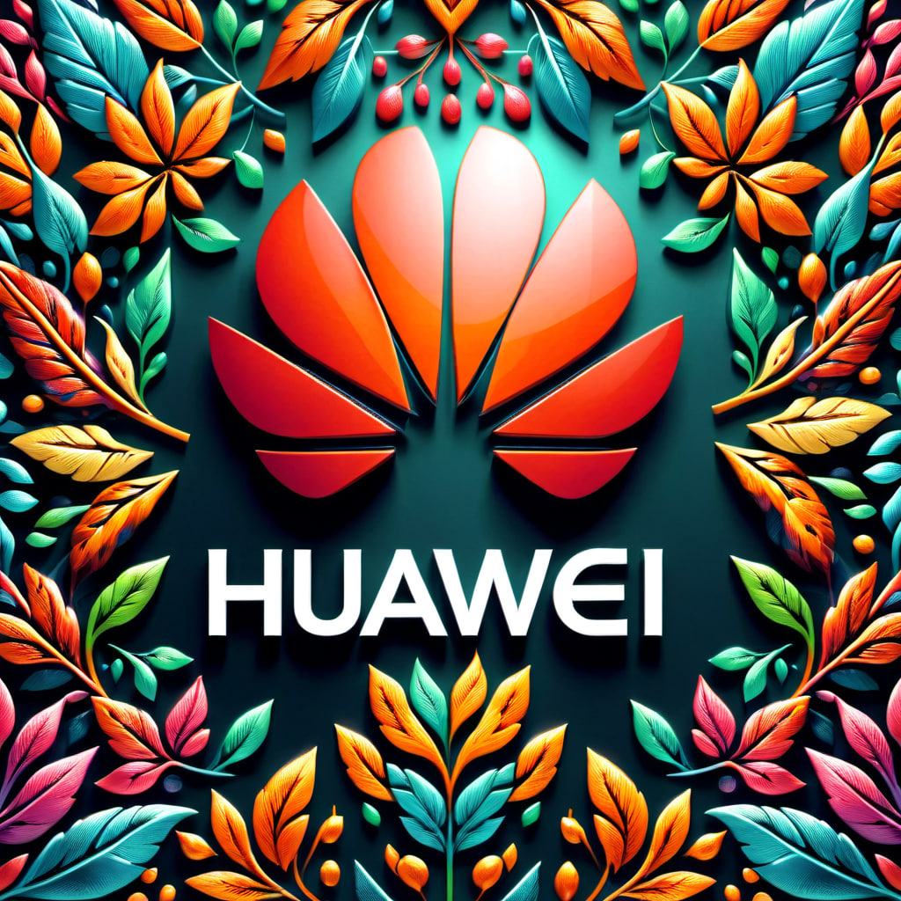

# AI Logo Generator

## 1. Model Download

1. [Crystal Clear XL](https://civitai.com/models/122822/crystal-clear-xl) ➡️ models/checkpoint
2. [Harrlogos XL](https://civitai.com/models/176555/harrlogos-xl-finally-custom-text-generation-in-sd) ➡️ models/lora

## 2. Drag json file to import

I believe anyone can do it easily

## 3. Install missing dependencies

Click manager button and install missing custom nodes. Then click restart to apply these new components.

## 4. Result Showing

1. Chen Li with Chinese Dragon

    
2. Shogun with samurai and katana

    

3. Huawei with flower background

    